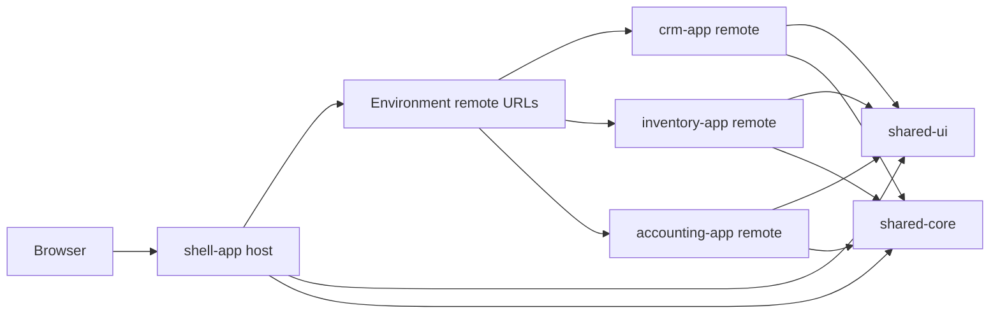

# Building an Angular 21 Micro-Frontend ERP/CRM Boilerplate: An Odoo-Inspired Case Study

By Amit Mahida

> TODO: enable GitHub Pages after the repository is pushed, then confirm the live demo URL before publishing.

## 1. Why micro-frontends for ERP/CRM platforms?

ERP and CRM products naturally grow into multiple business domains: sales, inventory, accounting, purchasing, projects, HR, and more. A single front-end can become hard to release safely because every domain team shares the same deployable unit.

Micro-frontends help split that surface into independently owned applications while keeping one cohesive user experience. In this case study, the shell application owns the common frame and each business module is delivered as a remote.

Backend integration is intentionally skipped in this article. Everything uses typed mock data so we can focus on Angular 21, standalone components, Native Federation, route boundaries, and static deployment.

## 2. Case study: Odoo-style modular ERP/CRM

This demo is inspired by modular ERP/CRM platforms, but it does not copy branding, assets, or product experience from any existing platform.

The goal is to model a realistic SaaS foundation:

- CRM owns leads, opportunities, customers, and pipeline screens.
- Inventory owns products, stock movements, and warehouses.
- Accounting owns invoices, payments, and ledger placeholders.
- Shared libraries provide UI primitives and typed contracts.
- The shell composes everything at runtime.

## 3. Final architecture



## 4. Apps and responsibilities

The monorepo contains:

```text
projects/
  shell-app/
  crm-app/
  inventory-app/
  accounting-app/
  shared-ui/
  shared-core/
```

The shell is the host. It has the dashboard, navigation, auth placeholder, remote loading, and fallback UI.

The remotes are independently runnable Angular apps. They expose route arrays instead of individual components so each remote keeps ownership of its internal navigation.

## 5. Creating the Angular 21 workspace

Start with an empty Angular workspace:

```bash
ng new angular21-erp-crm-microfrontends \
  --create-application=false \
  --strict \
  --package-manager=npm
```

Then generate apps and libraries:

```bash
ng generate application shell-app --routing --style=scss --standalone
ng generate application crm-app --routing --style=scss --standalone
ng generate application inventory-app --routing --style=scss --standalone
ng generate application accounting-app --routing --style=scss --standalone
ng generate library shared-ui
ng generate library shared-core
```

Use Node `22.12.0` or another Angular 21 supported version:

```bash
nvm use
npm ci
```

## 6. Adding shell and remote apps

Each remote has its own `remote-entry.routes.ts`:

```ts
export const REMOTE_ROUTES: Routes = [
  {
    path: '',
    component: CrmWorkspaceComponent,
    children: [
      { path: '', pathMatch: 'full', component: LeadsComponent },
      { path: 'opportunities', component: OpportunitiesComponent },
      { path: 'customers', component: CustomersComponent },
      { path: 'pipeline', component: PipelineComponent },
    ],
  },
];
```

The shell imports remotes only through federation, not direct TypeScript imports.

## 7. Setting up Native Federation / Module Federation

Install Native Federation:

```bash
npm install @angular-architects/native-federation@21.2.3
```

Initialize the shell as a dynamic host and each business app as a remote:

```bash
ng generate @angular-architects/native-federation:init --project shell-app --port 4200 --type dynamic-host
ng generate @angular-architects/native-federation:init --project crm-app --port 4201 --type remote
ng generate @angular-architects/native-federation:init --project inventory-app --port 4202 --type remote
ng generate @angular-architects/native-federation:init --project accounting-app --port 4203 --type remote
```

Remote federation config example:

```js
module.exports = withNativeFederation({
  name: 'crm-app',
  exposes: {
    './Routes': './projects/crm-app/src/app/remote-entry.routes.ts',
  },
  shared: {
    ...shareAll({ singleton: true, strictVersion: true, requiredVersion: 'auto' }),
  },
});
```

## 8. Building shared UI and shared core libraries

`shared-core` contains interfaces, mock data, route metadata, and formatting helpers.

`shared-ui` contains reusable standalone components:

- `ui-button`
- `ui-card`
- `ui-badge`
- `ui-data-table`
- `ui-sidebar`
- `ui-topbar`

Keep these libraries boring and reusable. Domain decisions belong in the remotes.

## 9. Loading CRM, Inventory, and Accounting remotes from shell

The shell keeps environment-specific remote entries:

```ts
export const environment = {
  production: false,
  remoteEntries: {
    'crm-app': 'http://localhost:4201/remoteEntry.json',
    'inventory-app': 'http://localhost:4202/remoteEntry.json',
    'accounting-app': 'http://localhost:4203/remoteEntry.json',
  },
};
```

Then it initializes federation before bootstrapping Angular:

```ts
initFederation(environment.remoteEntries)
  .then(() => import('./bootstrap'))
  .catch((err) => console.error(err));
```

Routes are lazy loaded:

```ts
{
  path: 'crm',
  loadChildren: () => loadRemoteRoutes(crmRemote),
}
```

## 10. Running each remote independently

Use four terminals:

```bash
npm run start:crm
npm run start:inventory
npm run start:accounting
npm run start:shell
```

Each remote is a normal Angular app:

- CRM: `http://localhost:4201`
- Inventory: `http://localhost:4202`
- Accounting: `http://localhost:4203`
- Shell: `http://localhost:4200`

## 11. Handling remote loading failures

The shell wraps `loadRemoteModule` in a helper. If a remote fails, it logs the error and returns fallback routes:

```ts
return [
  {
    path: '',
    component: RemoteFallbackComponent,
    data: { remote, errorMessage },
  },
];
```

This keeps the shell usable even if one remote is offline.

## 12. Deploying shell and remotes to GitHub Pages

GitHub Pages serves one static artifact. This repo builds the shell at the root and remotes under `/remotes/*`:

```text
dist/github-pages/
  index.html
  404.html
  remotes/
    crm/
    inventory/
    accounting/
```

Build the Pages artifact:

```bash
npm run build:gh-pages
```

Enable GitHub Pages with **Source: GitHub Actions**. The workflow in `.github/workflows/pages.yml` uploads `dist/github-pages`.

Production remote URLs use the repository base path:

```ts
const repoName = 'angular21-erp-crm-microfrontends';

export const environment = {
  production: true,
  remoteEntries: {
    'crm-app': `/${repoName}/remotes/crm/remoteEntry.json`,
    'inventory-app': `/${repoName}/remotes/inventory/remoteEntry.json`,
    'accounting-app': `/${repoName}/remotes/accounting/remoteEntry.json`,
  },
};
```

## 13. GitHub repo links section

- Repository: `https://github.com/amitmahida92/angular21-erp-crm-shell`
- Live demo: `https://amitmahida92.github.io/angular21-erp-crm-shell/`
- CRM remote entry: `https://amitmahida92.github.io/angular21-erp-crm-shell/remotes/crm/remoteEntry.json`
- Inventory remote entry: `https://amitmahida92.github.io/angular21-erp-crm-shell/remotes/inventory/remoteEntry.json`
- Accounting remote entry: `https://amitmahida92.github.io/angular21-erp-crm-shell/remotes/accounting/remoteEntry.json`

## 14. What comes next: connecting Java microservices

The next article can replace mock data with real service adapters:

- Spring Boot CRM, Inventory, and Accounting services.
- API gateway or BFF for composition.
- OAuth/OIDC identity provider.
- Tenant-aware route guards and role-aware navigation.
- Contract tests between front-end DTOs and Java API schemas.

For now, this repo gives you the clean front-end foundation: Angular 21, standalone components, Native Federation, independently runnable remotes, fallback UI, and GitHub Pages deployment.
